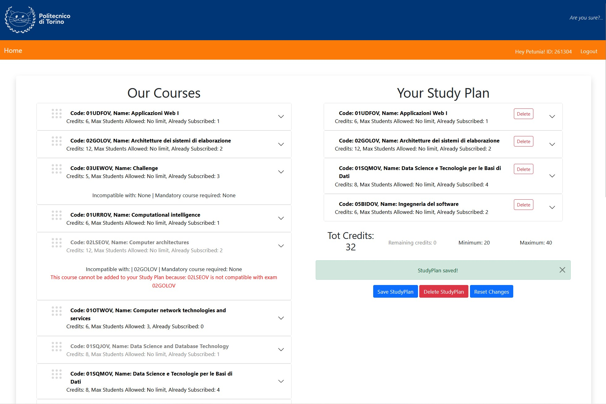

# Studyplan: Studyplan manager for university students

Final Project for the Web Application 1 course in Politecnico di Torino.
This project implements both front-end and back-end of a studyplan manager for multiple students. It saves the user studyplan in a local DB and makes it avialable at next login. 
The back-end exposes APIs as explained in the following description.
React and bootstrap were used for creating a simple and coincise front-end, mimiching the Politecnico di Torino student's area.


## React Client Application Routes

- Route `/`: Homepage, contains CourseTable which will always show the University's courses and, conditionally, the user's Study Plan
- Route `/login`: Contains Login Form

## API Server

- POST `/api/login`

  Performs the login operation, creating the session

  **Request header:** _none_

  **Request body:** 
  ```
  {
    "username": "username",
    "password": "password"
  }
  ```
  **Response:** `201 Created` (success), `401 Unauthorized` (wrong username or password) or `500 Internal Server Error` (generic error).

  **Response body:**
  ```
  {
    "id": id,
    "name": "name",
    "planType": "full"
  }
  ```

- GET `/api/sessions/current`

  Get current user session
  
  **Request header:** _none_

  **Request body:** _none_

  **Response:** `200 OK` (success), `401 Unauthorized` (user is not logged in) or `500 Internal Server Error` (generic error).

  **Response body:**
  ```
  {
    "id": id,
    "name": "name",
    "planType": "full"
  }
  ```

- GET `/api/courses/`

  Get list of available courses
  
  **Request header:** _none_

  **Request body:** _none_

  **Response:** `200 OK` (success), `500 Internal Server Error` (generic error).

  **Response body:**
  ```
  {
    {
      "id": id,
      "name": "name",
      "credits": credits,
      "maxStudents": maxStudents,
      "incompatibleWith": incompatibleWith,
      "preparatoryCourse": preparatoryCourse,
      "subscribedUsers": subscribedUsers
    }, 
    ...
  }
  ```

- GET `/api/courses/studyplan`

  Get User Study Plan - **Authenticated API**
  
  **Request header:** _none_

  **Request body:** _none_

  **Response:** `200 OK` (success), `401 Unauthorized` (user is not logged in) or `500 Internal Server Error` (generic error).

  **Response body:**
  ```
  {
    {
      "id": id,
      "name": "name",
      "credits": credits,
      "maxStudents": maxStudents,
      "incompatibleWith": incompatibleWith,
      "preparatoryCourse": preparatoryCourse,
      "subscribedUsers": subscribedUsers
    }, 
    ...
  }
  ```

- POST `/api/courses/studyplan/`

  Insert or modify the current Study Plan - **Authenticated API**
  
  **Request header:** _none_

  **Request body:** {
    ["01NYHOV","01TXSOV",...]
  }

  **Response:** `201 OK` (success), `401 Unauthorized` (user is not logged in), `422 Unprocessable Entity` (validation of exam id failed) or `500 Internal Server Error` (generic error).

  **Response body:** _none_

- POST `/api/courses/studyplan/type`

  Formally creates an empty Study Plan by setting its type - **Authenticated API**
  
  **Request header:** _none_

  **Request body:** {
    "type":"full"
  }

  **Response:** `201 OK` (success), `401 Unauthorized` (user is not logged in), `422 Unprocessable Entity` (validation of exam id failed) or `500 Internal Server Error` (generic error).

  **Response body:** _none_

- DELETE `/api/courses/studyplan`

  Delete the whole Study Plan - **Authenticated API**
  
   **Request header:** _none_

  **Request body:** _none_

  **Response:** `204 OK` (success), `401 Unauthorized` (user is not logged in), `422 Unprocessable Entity` (validation of exam id failed) or `500 Internal Server Error` (generic error).

  **Response body:** _none_
 

## Database Tables

- Table `users`. Contains fields:
  - *id*	INTEGER NOT NULL UNIQUE,
	- *name*	TEXT,
	- *partTime*	INTEGER NOT NULL,
	- *userName*	TEXT,
	- *password*	TEXT,
	- *salt*	TEXT
- Table `courses`. Contains fields:
  - *code*	TEXT NOT NULL UNIQUE,
	- *name*	TEXT,
	- *credits*	INTEGER,
	- *maxStudents*	INTEGER,
	- *incompatibleWith*	TEXT,
	- *preparatoryCourse*	TEXT,
	- *subscribedUsers*	INTEGER
- Table `coursesIncompatibleWith`. Contains fields:
  - *course* TEXT NOT NULL,
  - *incompatibleWith* TEXT NOT NULL
- Table `studyPlan`. Contains fields:
  -*userId*	INTEGER NOT NULL,
	- *exam*	TEXT NOT NULL, 

## Main React Components
### NavBar(s) 
*Files in `/src/components/NavBar.js`*
- `MainNavBar`: Renders the utility Navbar, which includes User info and login/logout buttons
- `LogoNavBar`: Renders the NavBar with the PoliTo logo, purely for aestetic purposes

### Login
- `LoginForm` (in `LoginForm.js`): Renders a login form for performing login

### Course Tables
*Files in `/src/components/CourseTable.js`*
- `CourseTable`: Conditionally renders SourceTable, for University Courses, and, if the user is logged in, DropZoneTable for user's Study Plan
- `SourceTable`: Displays the courses offered by the university, which will conditionally be draggable of not. This is the source table for drag and drop, as items can be dragged but not dropped in it.
- `DropZoneTable`: Displays the user's Study Plan, acting as the drop zone for drag and drop, as items can be dropped in it but not dragged from. Has buttons that allow to save, delete or reset the Study Plan
- `CourseRow`: Displays a single row both in SourceTable and DropZoneTable. Displays a delete button for the single course only if used in DropZoneTable. Includes Alert for error or success in saving the Study Plan on the backend.
- `CreditsCounter`: Displays a credits counter under the DropZoneTable

## Screenshot
### Anonymous Homepage


### Login Form


### Logged Homepage



## Users Credentials
All password are `1234`.

|User|Password|
|----|--------|
|marco|1234| 
|discobear|1234|
|petunia|1234|
|mrpickels|1234|
|giggles|1234|
|flippy|1234| 
